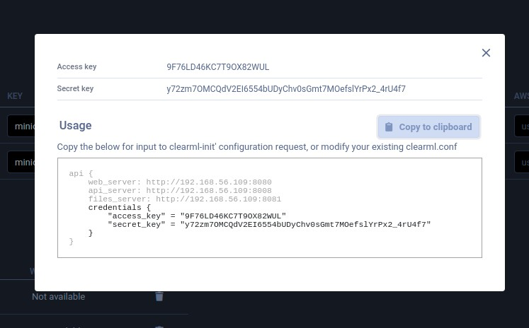
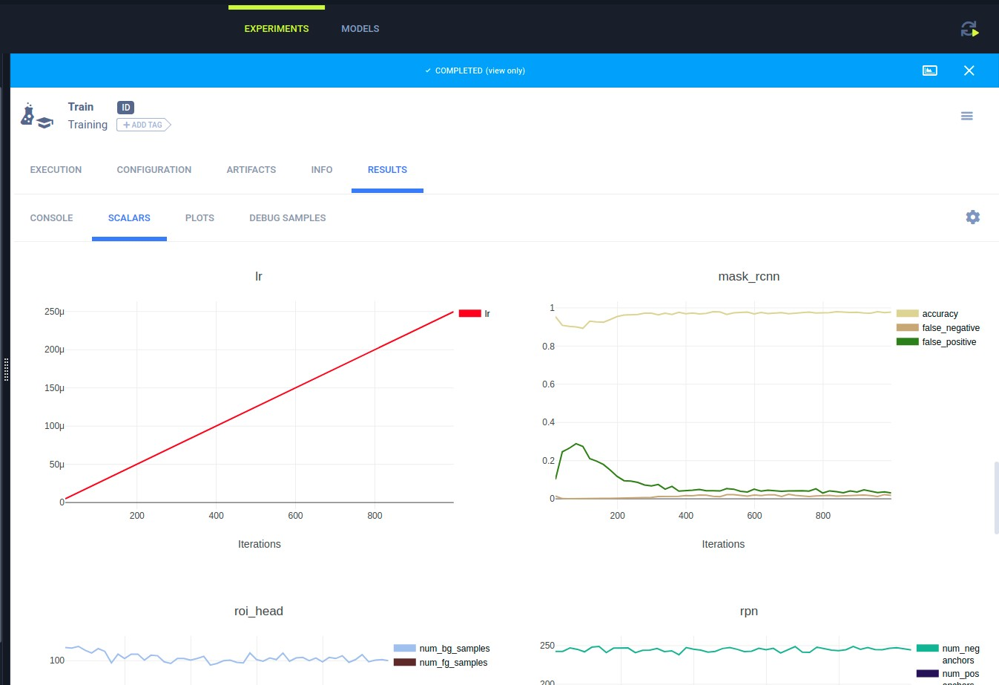
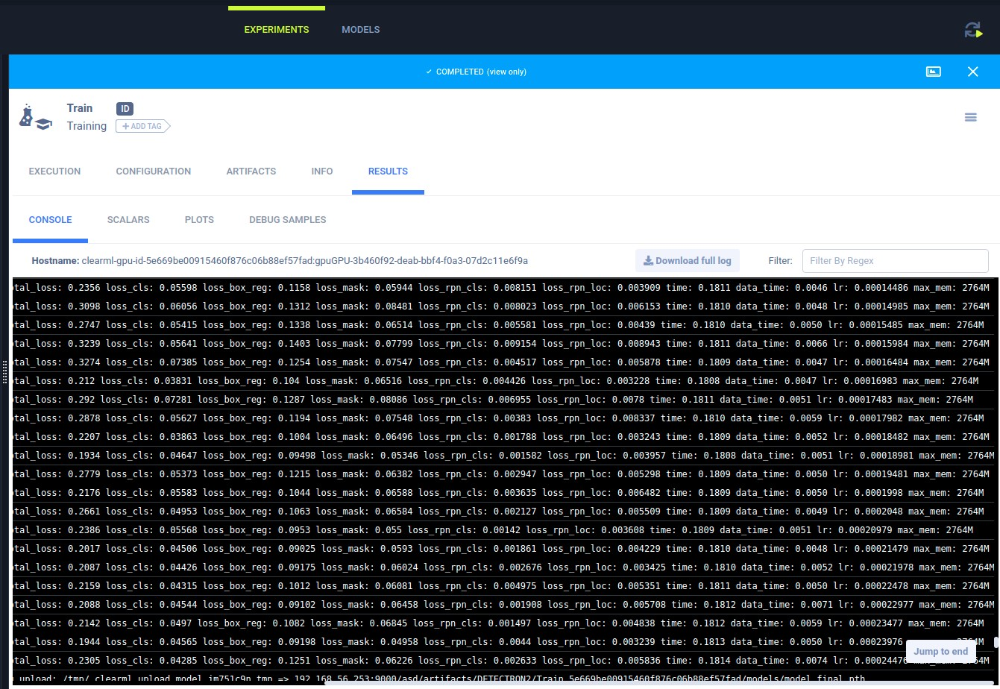
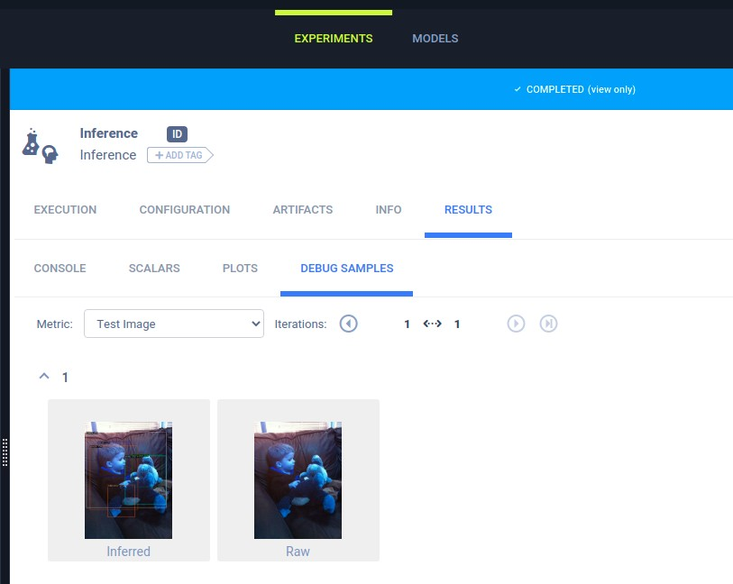
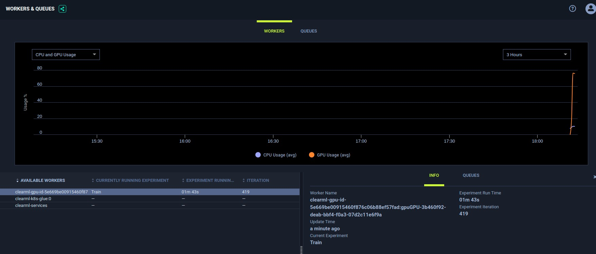

## 3rd Party Source codes on laptop, train and track experiments on ClearML server
There are a lot of times when we would use solutions that were available from the Internet. As long as their solution is Python based, we can make use of ClearML to make the development follow ML Ops process. In this article, we will use Detectron2 (https://github.com/facebookresearch/detectron2) as an example.

#### Overview
Detectron2 is FAIR's next gen platform for object detection and segmentation. It is fairly complex but once installed, it can support custom python scripts that call its libraries. For this article, we will develop 2 different custom scripts as describe on the detectron2 github page, one for inference and other other for training.

#### (1) Creating a Detectron2 docker image
Installing Detectron2 comes with several dependancies and Facebook provided a Dockerfile so users need not fret over the installation. We will also use this Dockerfile to create an image, but making sure to add two more python packages, `clearml` and `boto3` in the dockerfile.
```
RUN pip install clearml boto3
```
Building the image
```
docker build . -t harbor.io/custom/detectron2:v3
docker push harbor.io/custom/detectron2:v3
```

#### (2) Making model and model config available
Detectron2 library stores a set of models and respective configuration through its Model Zoo library. The configuration is typically in yaml format, while the model weights in pickle(pkl) format. The yaml file will point to the pickle file. Instead of packing all these into the docker image, it is recommended that these files be downloaded from storage by the running code after the container runs. This will offer a higher level of flexibility to model changes and also allow better tracking. In this case, the files are loaded in S3 MINIO. [http://192.168.56.253:9000/minio/demo-models/detectron2/](http://192.168.56.253:9000/minio/demo-models/detectron2/) 

#### (3) Ensure code is associated with a Git repo
```
> git status
On branch master
Your branch is up to date with 'origin/master'.

Changes not staged for commit:
  (use "git add <file>..." to update what will be committed)
  (use "git checkout -- <file>..." to discard changes in working directory)

	modified:   inference.py

Untracked files:
  (use "git add <file>..." to include in what will be committed)

no changes added to commit (use "git add" and/or "git commit -a")
```
Running `git status` will show if your codes are on a Git repo. You don't have to commit or push the changes as long as a version of it is already present on the Git server.

#### (4) Install and configure clearml on laptop
This is the only requirement, as you won't be running the code on your machine actually.
A good python practice is to use Python virtualenv for code development. This creates an isolated virtual space where you can install python packages without affecting the global setup.

Creating the python virtualenv
```bash
sudo apt update
sudo apt install python3-venv
python3 -m venv myvenv    #Installing the virtualenv
source myvenv/bin/activate #Activate the virtualenv, you can deactivate by typing 'deactivate'

# Your command prompt will show your virtualenv in brackets.
# Any pip and python commands will take place in the virtualenv.
(myvenv) /: 
```

Run the ClearML installer
```bash
pip install clearml
```
copy [clearml.conf](clearml.conf) to `~/clearml.conf`<br>
In the `~/clearml.conf`, change apt_server, web_server, files_server to the right IP/Name/Ports.<br> 
Credentials and secret_key can be retrieved by accessing the ClearML UI and then 'profile'.

```
api {
    web_server: http://[clearml]:8080
    api_server: http://[clearml]:8008
    files_server: http://[clearml]:8081
    credentials {
        "access_key" = "HRD53EF8RKAXRFH2EWX5"
        "secret_key" = "rKr-73sGB%YHPFfg1_S$ZgOkN73s6ue2u&Y6C_g5s@$&nYzAnl"
    }
}
```

#### (4) Inject clearml code into your codes
```python
#Put this at the beginning of your code that you will run from, even before the import statements
from clearml import Task
task = Task.init(project_name='Detectron2', task_name='Inference')
task.set_base_docker("[harbordock]/custom/detectron2:v3")
task.execute_remotely(queue_name="gpu", exit_process=True)
```
Now the first two lines are the standard lines that you need to put for ClearML<br>
The third line allows you to indicate which docker image to use to run your codes (See [harbor docker repo](https://192.168.56.108/harbor/projects)) <br>
The last line simply tell ClearML to assign this task to the GPU queue abd terminate the local run<br>

Note that we are not giving the option to run on the laptop because we are running the code with dependancies on the detectron2.

[*inference.py*](detectron2/codes/inference.py) - Inference code

```python
from clearml import Task, Logger
task = Task.init(project_name='DETECTRON2',task_name='Inference',task_type='inference', output_uri='s3://192.168.56.253:9000/asd/artifacts')
task.set_base_docker("harbor.io/custom/detectron2:v3 --env GIT_SSL_NO_VERIFY=true --env TRAINS_AGENT_GIT_USER=testuser --env TRAINS_AGENT_GIT_PASS=testuser" )
task.execute_remotely(queue_name="gpu", exit_process=True)

import detectron2
from detectron2.utils.logger import setup_logger
setup_logger()
import numpy as np
import os, json, cv2, random
from detectron2 import model_zoo
from detectron2.engine import DefaultPredictor
from detectron2.config import get_cfg
from detectron2.utils.visualizer import Visualizer
from detectron2.data import MetadataCatalog, DatasetCatalog

# Downloading the model and model config
import boto3
from botocore.client import Config
s3=boto3.resource('s3', 
        endpoint_url='http://192.168.56.253:9000',
        aws_access_key_id='minioadmin',
        aws_secret_access_key='minioadmin',
        config=Config(signature_version='s3v4'),
        region_name='us-east-1')
s3.Bucket('demo-models').download_file('detectron2/coco-detection/fast_rcnn_R_50_FPN_1x/fast_rcnn_R_50_FPN_1x.yaml','/home/appuser/detectron2_repo/detectron2/model_zoo/configs/COCO-Detection/fast_rcnn_R_50_FPN_1x.yaml')
s3.Bucket('demo-models').download_file('detectron2/coco-detection/fast_rcnn_R_50_FPN_1x/model_final_e5f7ce.pkl','/home/appuser/model_final_e5f7ce.pkl')
print("Downnloaded models")

im = cv2.imread("./pic.jpg")
task.get_logger().report_image(title='Test Image', series='Raw',iteration=1,image=im)

cfg = get_cfg()
cfg.merge_from_file(model_zoo.get_config_file('COCO-Detection/fast_rcnn_R_50_FPN_1x.yaml'))
print(cfg)
cfg.MODEL.DEVICE='cpu'
predictor = DefaultPredictor(cfg)
outputs=predictor(im)
v = Visualizer(im[:, :, ::-1], MetadataCatalog.get(cfg.DATASETS.TRAIN[0]), scale=1.2)
out = v.draw_instance_predictions(outputs["instances"].to("cpu"))
imoutput=out.get_image()[:, :, ::-1]
task.get_logger().report_image(title='Test Image', series='Inferred',iteration=1,image=imoutput)
```


[*prepare.py*](detectron2/codes/prepare.py) - Training code
```python
from clearml import Task, Logger
task = Task.init(project_name='DETECTRON2',task_name='Train',task_type='training', output_uri='s3://192.168.56.253:9000/asd/artifacts')
task.set_base_docker("harbor.io/custom/detectron2:v3 --env GIT_SSL_NO_VERIFY=true --env TRAINS_AGENT_GIT_USER=testuser --env TRAINS_AGENT_GIT_PASS=testuser" )
task.execute_remotely(queue_name="gpu", exit_process=True)

# Some basic setup:
# Setup detectron2 logger
import detectron2
from detectron2.utils.logger import setup_logger
setup_logger()
# import some common libraries
import numpy as np
import os, json, cv2, random
# import some common detectron2 utilities
from detectron2 import model_zoo
from detectron2.engine import DefaultPredictor
from detectron2.config import get_cfg
from detectron2.utils.visualizer import Visualizer
from detectron2.data import MetadataCatalog, DatasetCatalog
from detectron2.structures import BoxMode
from detectron2.engine import DefaultTrainer

# Downloading training data, model, model config
import boto3
from botocore.client import Config
s3=boto3.resource('s3',
        endpoint_url='http://192.168.56.253:9000',
        aws_access_key_id='minioadmin',
        aws_secret_access_key='minioadmin',
        config=Config(signature_version='s3v4'),
        region_name='us-east-1')
def download_s3_folder(bucket_name, s3_folder, local_dir=None):
    bucket = s3.Bucket(bucket_name)
    for obj in bucket.objects.filter(Prefix=s3_folder):
        target = obj.key if local_dir is None \
                else os.path.join(local_dir, os.path.relpath(obj.key, s3_folder))
        if not os.path.exists(os.path.dirname(target)):
            os.makedirs(os.path.dirname(target))
        if obj.key[-1] == '/':
            continue
        bucket.download_file(obj.key, target)

download_s3_folder('datasets','balloon','balloon')
s3.Bucket('demo-models').download_file('detectron2/coco-instancesegmentation/mask_rcnn_R_50_FPN_3x/mask_rcnn_R_50_FPN_3x.yaml','/home/appuser/detectron2_repo/detectron2/model_zoo/configs/COCO-InstanceSegmentation/mask_rcnn_R_50_FPN_3x.yaml')
s3.Bucket('demo-models').download_file('detectron2/coco-instancesegmentation/mask_rcnn_R_50_FPN_3x/model_final_f10217.pkl','/home/appuser/model_final_f10217.pkl')
print("Downnloaded data")

def get_balloon_dicts(img_dir):
    json_file = os.path.join(img_dir, "via_region_data.json")
    with open(json_file) as f:
        imgs_anns = json.load(f)

    dataset_dicts = []
    for idx, v in enumerate(imgs_anns.values()):
        record = {}
        
        filename = os.path.join(img_dir, v["filename"])
        height, width = cv2.imread(filename).shape[:2]
        
        record["file_name"] = filename
        record["image_id"] = idx
        record["height"] = height
        record["width"] = width
      
        annos = v["regions"]
        objs = []
        for _, anno in annos.items():
            assert not anno["region_attributes"]
            anno = anno["shape_attributes"]
            px = anno["all_points_x"]
            py = anno["all_points_y"]
            poly = [(x + 0.5, y + 0.5) for x, y in zip(px, py)]
            poly = [p for x in poly for p in x]

            obj = {
                "bbox": [np.min(px), np.min(py), np.max(px), np.max(py)],
                "bbox_mode": BoxMode.XYXY_ABS,
                "segmentation": [poly],
                "category_id": 0,
            }
            objs.append(obj)
        record["annotations"] = objs
        dataset_dicts.append(record)
    return dataset_dicts

for d in ["train", "val"]:
    DatasetCatalog.register("balloon_" + d, lambda d=d: get_balloon_dicts("balloon/" + d))
    MetadataCatalog.get("balloon_" + d).set(thing_classes=["balloon"])
balloon_metadata = MetadataCatalog.get("balloon_train")
print(balloon_metadata)

dataset_dicts = get_balloon_dicts("balloon/train")
for d in random.sample(dataset_dicts, 3):
    img = cv2.imread(d["file_name"])
    visualizer = Visualizer(img[:, :, ::-1], metadata=balloon_metadata, scale=0.5)
    out = visualizer.draw_dataset_dict(d)
    imout=out.get_image()[:, :, ::-1]

cfg = get_cfg()
cfg.merge_from_file(model_zoo.get_config_file("COCO-InstanceSegmentation/mask_rcnn_R_50_FPN_3x.yaml"))
print(cfg)
cfg.DATASETS.TRAIN = ("balloon_train",)
cfg.DATASETS.TEST = ()
cfg.DATALOADER.NUM_WORKERS = 2
cfg.SOLVER.IMS_PER_BATCH = 2
cfg.SOLVER.BASE_LR = 0.00025  # pick a good LR
cfg.SOLVER.MAX_ITER = 1000    # 300 iterations seems good enough for this toy dataset; you will need to train longer for a practical dataset
cfg.SOLVER.STEPS = []        # do not decay learning rate
cfg.MODEL.ROI_HEADS.BATCH_SIZE_PER_IMAGE = 128   # faster, and good enough for this toy dataset (default: 512)
cfg.MODEL.ROI_HEADS.NUM_CLASSES = 1  # only has one class (ballon). (see https://detectron2.readthedocs.io/tutorials/datasets.html#update-the-config-for-new-datasets)
# NOTE: this config means the number of classes, but a few popular unofficial tutorials incorrect uses num_classes+1 here.
os.makedirs(cfg.OUTPUT_DIR, exist_ok=True)
trainer = DefaultTrainer(cfg)
trainer.resume_or_load(resume=False)
trainer.train()
```
#### (5) Run the codes
You should see an output similar to following
```bash
> python3 inference.py
ClearML Task: created new task id=4ea6008b17b348fba7bf6bed26ebf775
ClearML results page: http://192.168.56.109:8080/projects/9c256bf3b6be43908e0e6e998b5e330e/experiments/4ea6008b17b348fba7bf6bed26ebf775/output/log
2021-04-09 18:10:52,263 - clearml - WARNING - Switching to remote execution, output log page http://192.168.56.109:8080/projects/9c256bf3b6be43908e0e6e998b5e330e/experiments/4ea6008b17b348fba7bf6bed26ebf775/output/log
2021-04-09 18:10:52,263 - clearml - WARNING - Terminating local execution process
```
```bash
> python3 prepare.py
ClearML Task: created new task id=5e669be00915460f876c06b88ef57fad
ClearML results page: http://192.168.56.109:8080/projects/9c256bf3b6be43908e0e6e998b5e330e/experiments/5e669be00915460f876c06b88ef57fad/output/log
2021-04-09 18:11:47,293 - clearml - WARNING - Switching to remote execution, output log page http://192.168.56.109:8080/projects/9c256bf3b6be43908e0e6e998b5e330e/experiments/5e669be00915460f876c06b88ef57fad/output/log
2021-04-09 18:11:47,293 - clearml - WARNING - Terminating local execution process
```

The ClearML code takes over immediately, communicate with the ClearML server and terminates the code prematurely. The training  did not happen on the laptop. Instead, the server has retrieved enough information to start code on the server. In this case, a Kubernetes pod has been spawned with the detectron2 docker image to run this code.

#### (5) Review the progress on the server
The screenshots explained in [this section](code-and-train-on-my-laptop-track-experiments-on-clearml-server.md#step-3-run-the-code) shows the information captured by ClearML server. Additional screenshots pertaining to this example shown below.


<table>
    <tbody>
        <tr>
        <td> </td>
        <td></td>
        </tr>
        <tr>
        <td colspan=2>The tensorboard data and console were automatically pulled out and displayed.</td>
        </tr>
        <tr>
        <td> </td>
        <td></td>
        </tr>
        <tr>
        <td>Images that were used in inference tests were uploaded. They can be ordered in terms of the raw image, and the subsequent inferred results, with just a single line of code</td>
        <td>During remote training, the gpu/cpu/ram/network usage number of iteration is also shown<td>
        </tr>
        
    </tbody>
</table>

