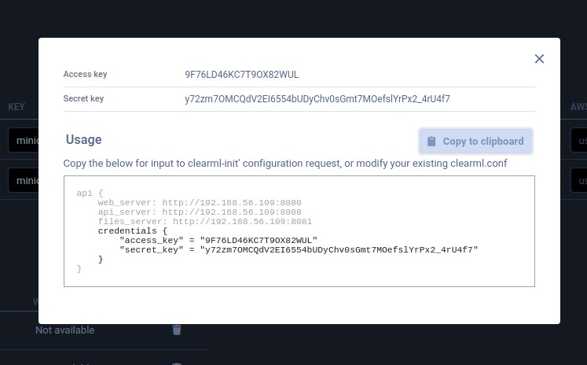
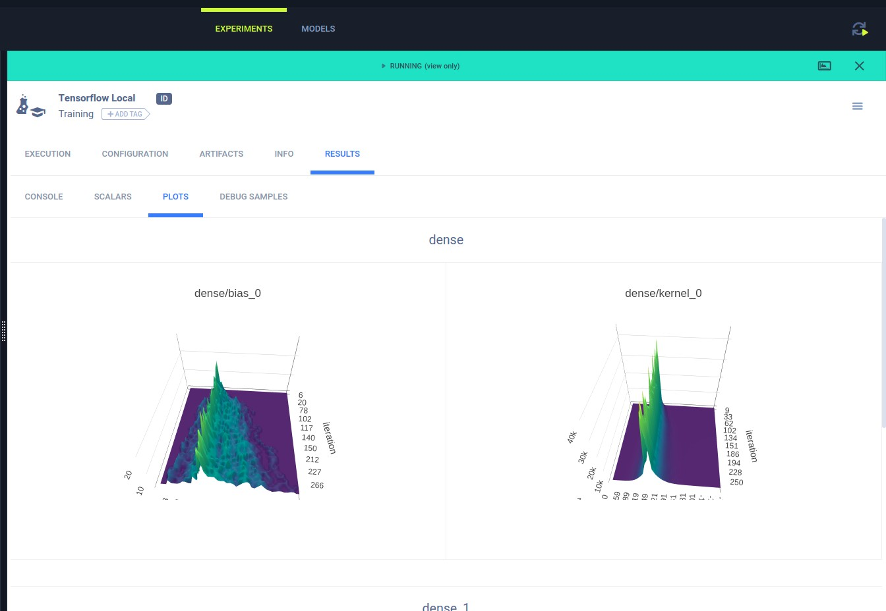

# Code and Train On My Laptop

When we are just testing if our code runs, or its just a simple piece of code but we still want to be able to track our experiments.

#### Step 1: Install and configure clearml on laptop
A good python practice is to use Python virtualenv for code development. This creates an isolated virtual space where you can install python packages without affecting the global setup.

Creating the python virtualenv
```bash
sudo apt update
sudo apt install python3-venv
python3 -m venv myvenv    #Installing the virtualenv
source myvenv/bin/activate #Activate the virtualenv, you can deactivate by typing 'deactivate'

# Your command prompt will show your virtualenv in brackets.
# Any pip and python commands will take place in the virtualenv.
(myvenv) /: 
```

Run the ClearML installer
```bash
pip install clearml
```
copy [clearml.conf](https://[gitlab]/tkahsion/services/-/raw/master/clearml.conf?inline=false) to `~/clearml.conf`<br>
In the `~/clearml.conf`, change apt_server, web_server, files_server to the right IP/Name/Ports.<br> 
Credentials and secret_key can be retrieved by accessing the ClearML UI and then 'profile'.<br>

```
api {
    web_server: http://[clearml]:8080
    api_server: http://[clearml]:8008
    files_server: http://[clearml]:8081
    credentials {
        "access_key" = "HRD53EF8RKAXRFH2EWX5"
        "secret_key" = "rKr-73sGB%YHPFfg1_S$ZgOkN73s6ue2u&Y6C_g5s@$&nYzAnl"
    }
}
```
#### Step 2: Inject ClearML code into your codes
If you are following one of the following frameworks, and you already have reporting codes (E.g. tensorboard), you may use a two liner ClearML code to perform a 'automagikal logging'. (Note: You can still choose to manual log if there's issues or there's non standard stuff to log)
-  PyTorch(incl' ignite/lightning), Tensorflow, Keras, AutoKeras, XGBoost and Scikit-Learn
```python
#Put this at the beginning of your codeset
from clearml import Task
task = Task.init(project_name='My Project Name - Event Extraction', task_name='My Task Name - Dygie')
```
```python
# A typical pytorch with tensorboard reporting would have something as follows, these will be captured by ClearML automatically
from torch.utils.tensorboard import SummaryWriter
.
.
writer = SummaryWriter('runs')
.
.
writer.add_scalar('Train/Loss', loss.data.item(), niter)
.
.
```
A set of working codes is already made available at [clearml/tensorflow_mnist.py](clearml/tensorflow_mnist.py).


If you are not following one of the above frameworks, you can use the manual approach.
Details of the manual approach can be found here. <br>
Tutorial:https://allegro.ai/clearml/docs/docs/tutorials/tutorial_explicit_reporting.html <br>
Examples: https://allegro.ai/clearml/docs/rst/examples/explicit_reporting/index.html

#### Step 3: Run the code
```
python3 tensorflow_mnist.py
2021-04-09 13:14:43.373189: W tensorflow/stream_executor/platform/default/dso_loader.cc:60] Could not load dynamic library 'libcudart.so.11.0'; dlerror: libcudart.so.11.0: cannot open shared object file: No such file or directory
2021-04-09 13:14:43.373214: I tensorflow/stream_executor/cuda/cudart_stub.cc:29] Ignore above cudart dlerror if you do not have a GPU set up on your machine.
tensorflow minst codes......
ClearML Task: created new task id=0d139e13a5c648d58048e5938c41a7d5
ClearML results page: http://192.168.56.109:8080/projects/e811bc9a97c34c3aad5482c541f0f4bb/experiments/0d139e13a5c648d58048e5938c41a7d5/output/log
2021-04-09 13:14:46.084141: I tensorflow/compiler/jit/xla_cpu_device.cc:41] Not creating XLA devices, tf_xla_enable_xla_devices not set
2021-04-09 13:14:46.102128: W tensorflow/stream_executor/platform/default/dso_loader.cc:60] Could not load dynamic library 'libcuda.so.1'; dlerror: libcuda.so.1: cannot open shared object file: No such file or directory
2021-04-09 13:14:46.102199: W tensorflow/stream_executor/cuda/cuda_driver.cc:326] failed call to cuInit: UNKNOWN ERROR (303)
2021-04-09 13:14:46.102249: I tensorflow/stream_executor/cuda/cuda_diagnostics.cc:156] kernel driver does not appear to be running on this host (aip-cli04): /proc/driver/nvidia/version does not exist
2021-04-09 13:14:46.117354: I tensorflow/core/platform/cpu_feature_guard.cc:142] This TensorFlow binary is optimized with oneAPI Deep Neural Network Library (oneDNN) to use the following CPU instructions in performance-critical operations:  AVX2 FMA
To enable them in other operations, rebuild TensorFlow with the appropriate compiler flags.
2021-04-09 13:14:46.132237: I tensorflow/compiler/jit/xla_gpu_device.cc:99] Not creating XLA devices, tf_xla_enable_xla_devices not set
Model: "sequential"
_________________________________________________________________
Layer (type)                 Output Shape              Param #   
=================================================================
flatten (Flatten)            (None, 784)               0         
_________________________________________________________________
dense (Dense)                (None, 128)               100480    
_________________________________________________________________
dense_1 (Dense)              (None, 10)                1290      
=================================================================
Total params: 101,770
Trainable params: 101,770
Non-trainable params: 0
_________________________________________________________________
2021-04-09 13:14:47.108999: I tensorflow/core/profiler/lib/profiler_session.cc:136] Profiler session initializing.
2021-04-09 13:14:47.109036: I tensorflow/core/profiler/lib/profiler_session.cc:155] Profiler session started.
2021-04-09 13:14:47.120089: I tensorflow/core/profiler/lib/profiler_session.cc:172] Profiler session tear down.
ClearML Monitor: GPU monitoring failed getting GPU reading, switching off GPU monitoring
Epoch 1/500
2021-04-09 13:14:48.073206: I tensorflow/compiler/mlir/mlir_graph_optimization_pass.cc:116] None of the MLIR optimization passes are enabled (registered 2)
2021-04-09 13:14:48.137679: I tensorflow/core/platform/profile_utils/cpu_utils.cc:112] CPU Frequency: 2699905000 Hz
  1/469 [..............................] - ETA: 22:03 - loss: 2.3730 - sparse_categorical_accuracy: 0.08592021-04-09 13:14:50.666794: I tensorflow/core/profiler/lib/profiler_session.cc:136] Profiler session initializing.
2021-04-09 13:14:50.666859: I tensorflow/core/profiler/lib/profiler_session.cc:155] Profiler session started.
2021-04-09 13:14:50.684612: I tensorflow/core/profiler/lib/profiler_session.cc:71] Profiler session collecting data.
2021-04-09 13:14:50.740751: I tensorflow/core/profiler/lib/profiler_session.cc:172] Profiler session tear down.
2021-04-09 13:14:50.796299: I tensorflow/core/profiler/rpc/client/save_profile.cc:137] Creating directory: logs/fit/20210409-131447/train/plugins/profile/2021_04_09_13_14_50
2021-04-09 13:14:50.799562: I tensorflow/core/profiler/rpc/client/save_profile.cc:143] Dumped gzipped tool data for trace.json.gz to logs/fit/20210409-131447/train/plugins/profile/2021_04_09_13_14_50/aip-cli04.trace.json.gz
2021-04-09 13:14:50.832611: I tensorflow/core/profiler/rpc/client/save_profile.cc:137] Creating directory: logs/fit/20210409-131447/train/plugins/profile/2021_04_09_13_14_50
2021-04-09 13:14:50.832955: I tensorflow/core/profiler/rpc/client/save_profile.cc:143] Dumped gzipped tool data for memory_profile.json.gz to logs/fit/20210409-131447/train/plugins/profile/2021_04_09_13_14_50/aip-cli04.memory_profile.json.gz
2021-04-09 13:14:50.833497: I tensorflow/core/profiler/rpc/client/capture_profile.cc:251] Creating directory: logs/fit/20210409-131447/train/plugins/profile/2021_04_09_13_14_50Dumped tool data for xplane.pb to logs/fit/20210409-131447/train/plugins/profile/2021_04_09_13_14_50/aip-cli04.xplane.pb
Dumped tool data for overview_page.pb to logs/fit/20210409-131447/train/plugins/profile/2021_04_09_13_14_50/aip-cli04.overview_page.pb
Dumped tool data for input_pipeline.pb to logs/fit/20210409-131447/train/plugins/profile/2021_04_09_13_14_50/aip-cli04.input_pipeline.pb
Dumped tool data for tensorflow_stats.pb to logs/fit/20210409-131447/train/plugins/profile/2021_04_09_13_14_50/aip-cli04.tensorflow_stats.pb
Dumped tool data for kernel_stats.pb to logs/fit/20210409-131447/train/plugins/profile/2021_04_09_13_14_50/aip-cli04.kernel_stats.pb

469/469 [==============================] - 4s 3ms/step - loss: 0.3598 - sparse_categorical_accuracy: 0.8895 - val_loss: 0.1251 - val_sparse_categorical_accuracy: 0.9628
Epoch 2/500
469/469 [==============================] - 1s 2ms/step - loss: 0.1027 - sparse_categorical_accuracy: 0.9679 - val_loss: 0.1278 - val_sparse_categorical_accuracy: 0.9630
.
.
.
Epoch 500/500
469/469 [==============================] - 1s 2ms/step - loss: 2.2760e-10 - sparse_categorical_accuracy: 1.0000 - val_loss: 3.3422 - val_sparse_categorical_accuracy: 0.9801
2021-04-09 13:22:11.533530: W tensorflow/python/util/util.cc:348] Sets are not currently considered sequences, but this may change in the future, so consider avoiding using them.
2021-04-09 13:22:12,224 - clearml.storage - INFO - Starting upload: /tmp/model_package.k0y6hodp.zip => 192.168.56.253:9000/vsmodels/snapshots/MNIST/Tensorflow Local.0d139e13a5c648d58048e5938c41a7d5/models/model.savedmodel.zip

============= model info ===========
KerasTensor(type_spec=TensorSpec(shape=(None, 28, 28, 1), dtype=tf.float32, name='flatten_input'), name='flatten_input', description="created by layer 'flatten_input'")
KerasTensor(type_spec=TensorSpec(shape=(None, 10), dtype=tf.float32, name=None), name='dense_1/BiasAdd:0', description="created by layer 'dense_1'")
2021-04-09 13:22:12,350 - clearml.Task - INFO - Waiting to finish uploads
2021-04-09 13:22:12,436 - clearml.Task - INFO - Completed model upload to s3://192.168.56.253:9000/vsmodels/snapshots/MNIST/Tensorflow Local.0d139e13a5c648d58048e5938c41a7d5/models/model.savedmodel.zip
2021-04-09 13:22:12,633 - clearml.Task - INFO - Finished uploading

```
Running your code above simply runs the data load, and then model training right on your laptop. The only difference is that ClearML is actually posting the updates to the ClearML server behind the scenes. Some screenshots from this run is show below.
<table>
    <tbody>
        <tr>
        <td> </td>
        <td></td>
        </tr>
        <tr>
        <td colspan=2>Both the console output and the tensorboard information is sent and displayed on ClearML.</td>
        </tr>
        <tr>
        <td> </td>
        <td></td>
        </tr>
        <tr>
        <td>If the code uses matplotlib, the information will be displayed as well.</td>
        <td>Model saved are automatically uploaded into ClearML as well. This will provide the require <b>Model Versioning</b><td>
        </tr>
        <tr>
        <td> </td>
        <td></td>
        </tr>
        <tr>
        <td colspan=2>Miscellaneous information that can be extracted from the codes are sent up as well</td>
        </tr>
    </tbody>
</table>
