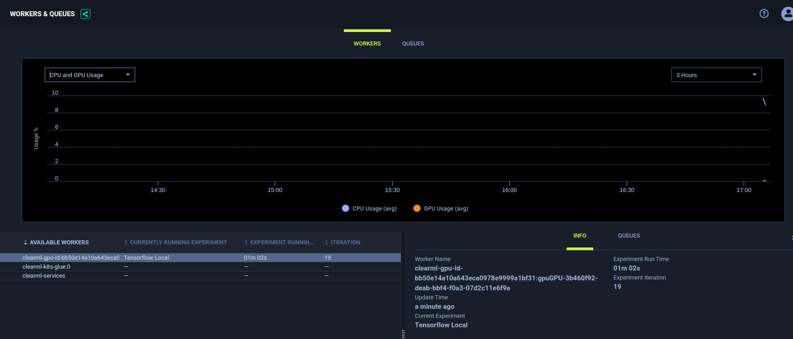

## Code on my laptop, train and track experiments on ClearML server
To train a larger model on more powerful machines, we can submit the whole image as a Kubernetes job to the GPU farm. ClearML has been setup to simplify this process. This section shows you how to simply add three more lines in the code.

#### Overview
The idea is to tell ClearML that you are (1) sending an experiment to its queue (2) terminating the code from running locally. For ClearML to do this, it needs to be able to pull the entire repo of codes from a Git repo, so this means the codes must pushed at least once inside a git repo before this can work.

#### (1) Ensure code is associated with a Git repo
```
> git status
On branch master
Your branch is up to date with 'origin/master'.

Changes not staged for commit:
  (use "git add <file>..." to update what will be committed)
  (use "git checkout -- <file>..." to discard changes in working directory)

	modified:   tensorflow_mnist.py

Untracked files:
  (use "git add <file>..." to include in what will be committed)

no changes added to commit (use "git add" and/or "git commit -a")
```
Running `git status` will show if your codes are on a Git repo. You don't have to commit or push the changes as long as a version of it is already present on the Git server.

#### (2) Install and configure clearml on laptop
This is the only requirement, as you won't be running the code on your machine actually.
A good python practice is to use Python virtualenv for code development. This creates an isolated virtual space where you can install python packages without affecting the global setup.

Creating the python virtualenv
```bash
sudo apt update
sudo apt install python3-venv
python3 -m venv myvenv    #Installing the virtualenv
source myvenv/bin/activate #Activate the virtualenv, you can deactivate by typing 'deactivate'

# Your command prompt will show your virtualenv in brackets.
# Any pip and python commands will take place in the virtualenv.
(myvenv) /: 
```

Run the ClearML installer
```bash
pip install clearml
```
copy [clearml.conf](clearml.conf) to `~/clearml.conf`<br>
In the `~/clearml.conf`, change apt_server, web_server, files_server to the right IP/Name/Ports.<br> 
Credentials and secret_key can be retrieved by accessing the ClearML UI and then 'profile'.

```
api {
    web_server: http://[clearml]:8080
    api_server: http://[clearml]:8008
    files_server: http://[clearml]:8081
    credentials {
        "access_key" = "HRD53EF8RKAXRFH2EWX5"
        "secret_key" = "rKr-73sGB%YHPFfg1_S$ZgOkN73s6ue2u&Y6C_g5s@$&nYzAnl"
    }
}
```

#### (3) Inject clearml code into your codes
```python
#Put this at the beginning of your code that you will run from, even before the import statements
from clearml import Task
task = Task.init(project_name='My Project Name - Event Extraction', task_name='My Task Name - Dygie')
task.set_base_docker("[harbordock]/nvidia/cuda:10.1-runtime-ubuntu18.04")
task.execute_remotely(queue_name="gpu", exit_process=True)
```
Now the first two lines are the standard lines that you need to put for ClearML<br>
The third line allows you to indicate which docker image to use to run your codes (See [harbor docker repo](https://192.168.56.108/harbor/projects)) <br>
The last line simply tell ClearML to assign this task to the GPU queue abd terminate the local run<br>

#### (4) Run your codes
You should see an output similar to following
```bash
> python3 tensorflow_mnist.py
2021-04-09 16:24:47.927170: W tensorflow/stream_executor/platform/default/dso_loader.cc:60] Could not load dynamic library 'libcudart.so.11.0'; dlerror: libcudart.so.11.0: cannot open shared object file: No such file or directory
2021-04-09 16:24:47.927197: I tensorflow/stream_executor/cuda/cudart_stub.cc:29] Ignore above cudart dlerror if you do not have a GPU set up on your machine.
ClearML Task: overwriting (reusing) task id=fa88c2eea4b74e5389b3293a48145caf
ClearML results page: http://192.168.56.109:8080/projects/e811bc9a97c34c3aad5482c541f0f4bb/experiments/fa88c2eea4b74e5389b3293a48145caf/output/log
2021-04-09 16:24:50,866 - clearml - WARNING - Switching to remote execution, output log page http://192.168.56.109:8080/projects/e811bc9a97c34c3aad5482c541f0f4bb/experiments/fa88c2eea4b74e5389b3293a48145caf/output/log
2021-04-09 16:24:50,866 - clearml - WARNING - Terminating local execution process
```
As you can see, the code was loaded from a laptop without a CPU thus the CUDA error. However, the ClearML code takes over immediately, communicate with the ClearML server and terminates the code prematurely. The training  did not happen on the laptop. Instead, the server has retrieved enough information to start code on the server. In this case, a Kubernetes pod has been spawned to run this code.
The sample code used here is available at [tensorflow_mnist.py](tensorflow_mnist.py)

#### (5) Review the progress on the server
The screenshots explained in [this section](code-and-train-on-my-laptop-track-experiments-on-clearml-server.md#step-3-run-the-code) shows the information captured by ClearML server. 
<table>
    <tbody>
        <tr>
        <td> </td>
        <td></td>
        </tr>
        <tr>
        <td colspan=2>Both the console output and the tensorboard information is sent and displayed on ClearML.</td>
        </tr>
        <tr>
        <td> </td>
        <td></td>
        </tr>
        <tr>
        <td>If the code uses matplotlib, the information will be displayed as well.</td>
        <td>Model saved are automatically uploaded into ClearML as well. This will provide the require <b>Model Versioning</b><td>
        </tr>
        <tr>
        <td> </td>
        <td></td>
        </tr>
        <tr>
        <td colspan=2>Miscellaneous information that can be extracted from the codes are sent up as well</td>
        </tr>
        <tr>
        <td colspan=2></td>
        <td colspan=2>On top of that, it also shows information about the Kubernetes pod that was running the training remotely.</td>
        </tr>

    </tbody>
</table>

